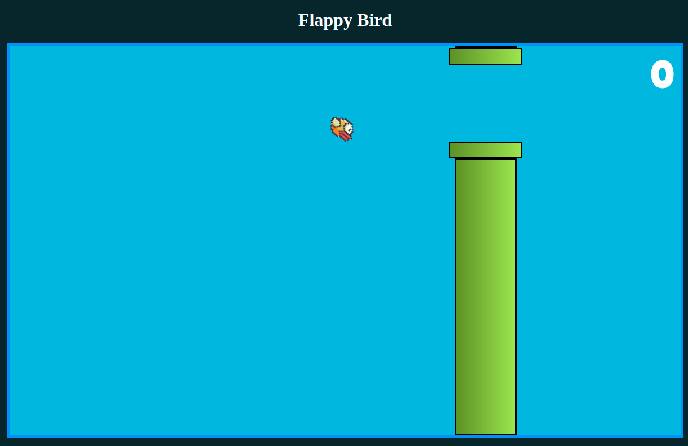

# Web Flappy Bird

Flappy Bird made with HTML, CSS, and JS.

## Getting started

Clone this repository.

```bash
git clone https://github.com/jpssantiago/portfolio
```

Install dependencies

```bash
yarn
(or npm i)
```

Enjoy :)

```bash
yarn start
(or npm start)
```

<!--## Images -->


## License
[MIT](LICENSE)